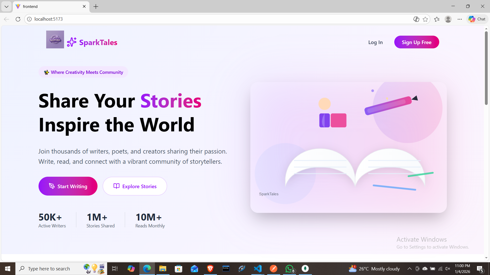
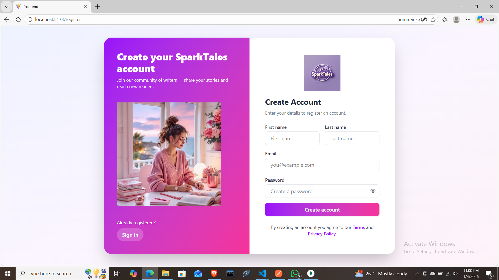
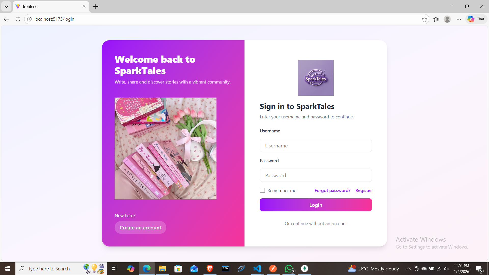
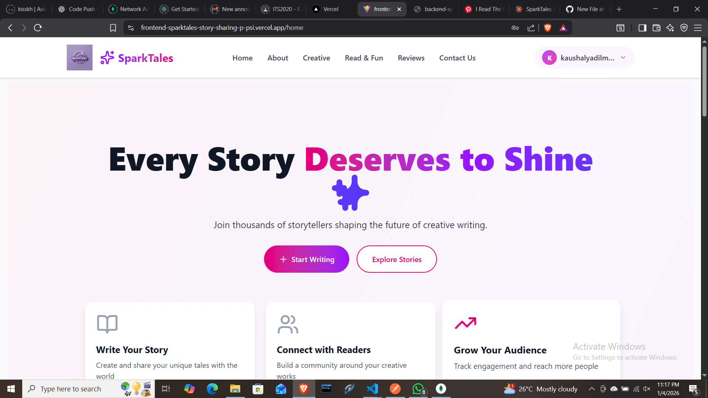
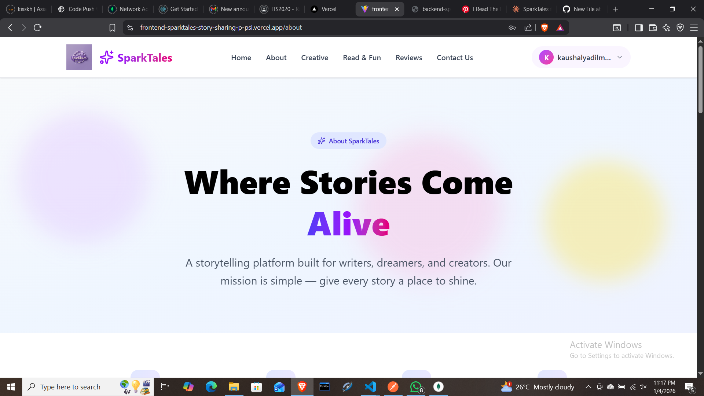
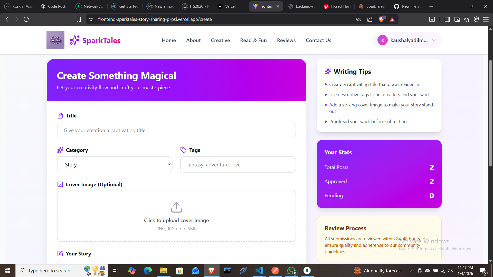
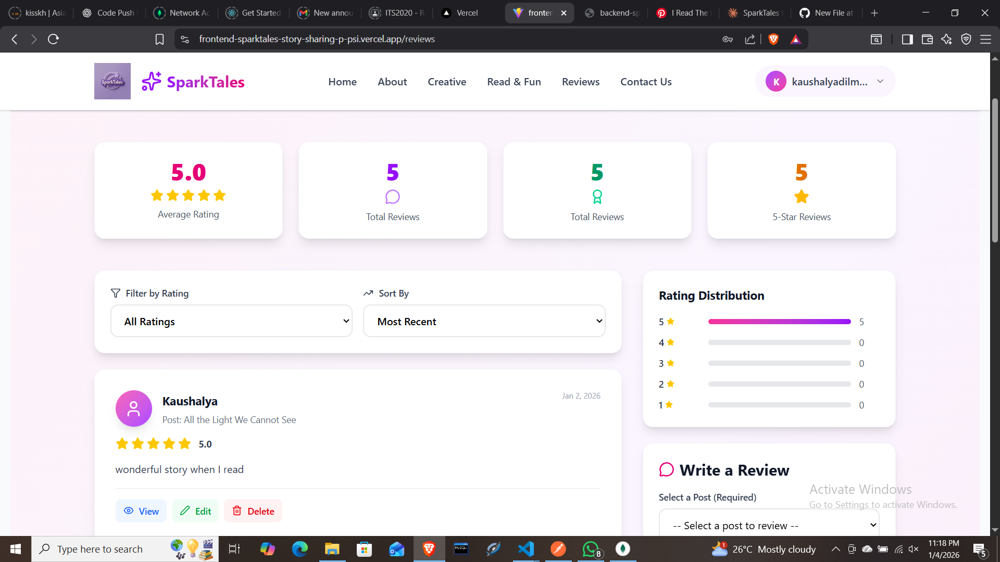
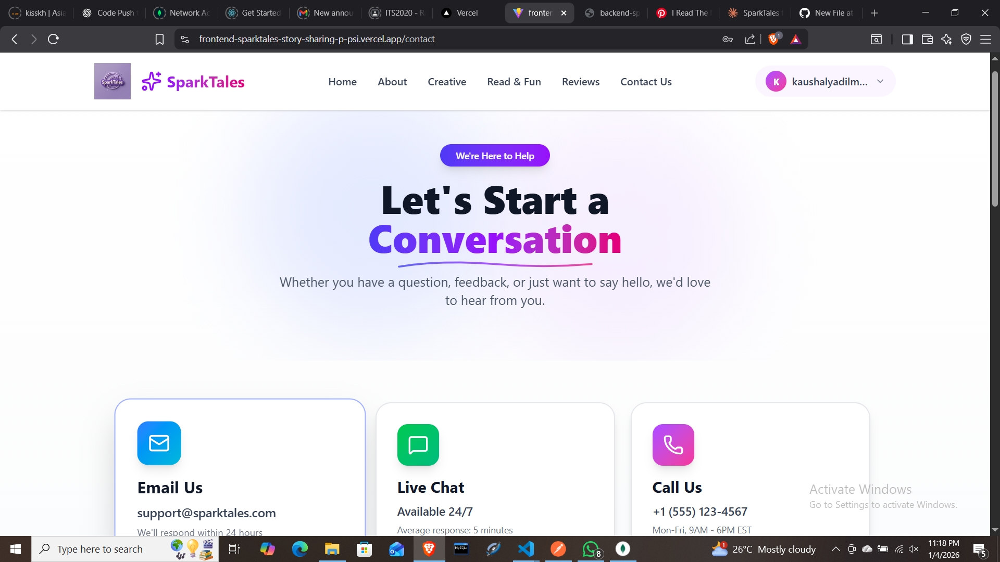
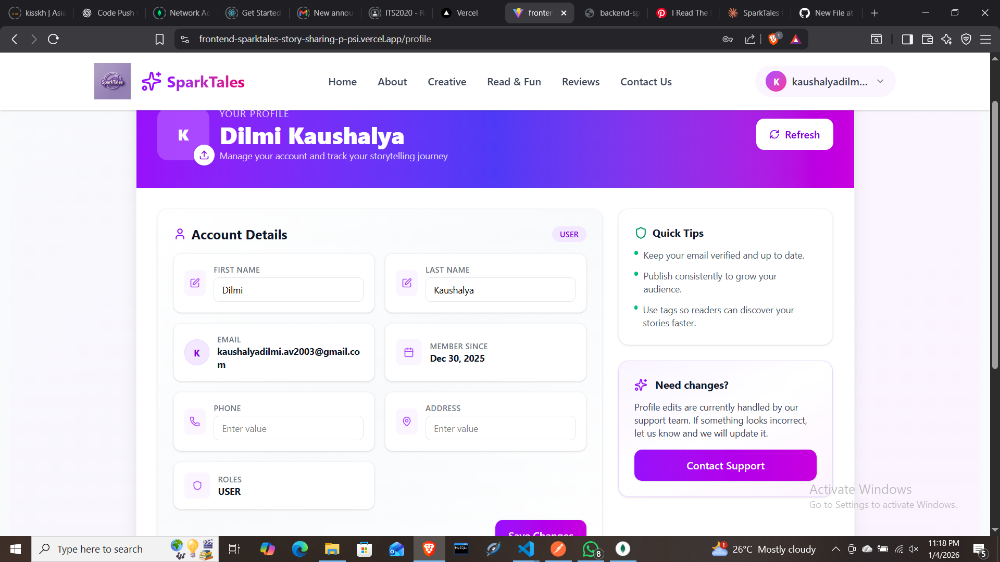
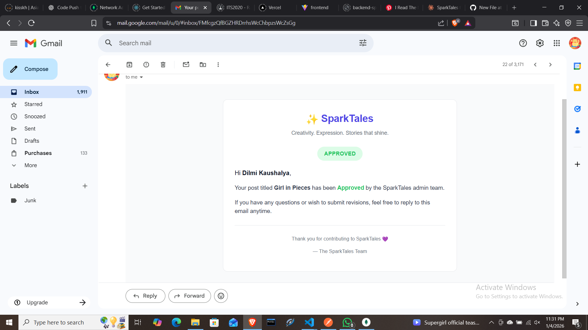

# SparkTales - Full Stack Story Sharing Platform


SparkTales is a full-stack web application built with the **MERN stack (MongoDB, Express, React, Node.js) and TypeScript**. It allows writers to create, share, and manage stories while providing a responsive, secure, and scalable platform for readers and admins alike.

---

## 🌟 Project Overview

This project is a **Rapid Application Development (RAD)** initiative to design, implement, and deploy a **modern web application** adhering to agile principles and professional standards. SparkTales features role-based access, secure authentication, and user-friendly interfaces.

**Learning Outcomes:**
- Build full-stack applications using the MERN + TypeScript stack.
- Implement secure authentication & authorization with JWT and bcryptjs.
- Deploy cloud-hosted applications with Vercel and MongoDB Atlas.
- Manage state with Redux and create responsive UIs with TailwindCSS.

**Professional Relevance:**  
Prepares for roles such as:
- Full Stack Developer (MERN + TypeScript)  
- Frontend Developer (React + TypeScript)  
- Backend Developer (Node.js + Express + MongoDB)  

---

## 🛠️ Technologies & Tools

**Frontend:**
- React + TypeScript  
- Redux for state management  
- TailwindCSS for responsive design  
- React Router for navigation  
- Axios for API requests  

**Backend:**
- Node.js + Express.js + TypeScript  
- MongoDB Atlas + Mongoose for database modeling  
- JWT & bcryptjs for authentication and security  
- dotenv for environment variable management  

**Other Tools & Services:**
- Vercel (Frontend Deployment)  
- send email  
- SweetAlert2 for interactive notifications  
- Cloudinary for image management  

---

## 📐 System Architecture

- **Client-Server Architecture**: React frontend communicates with Express backend via RESTful APIs.  
- **Database**: MongoDB Atlas with Mongoose schema validation.  
- **Authentication**: JWT-based with role-based authorization (Admin, Author, User).  
- **Folder Structure (Backend Example)**:

backend/
├── controllers/
├── middleware/
├── models/
├── routes/
├── utils/
├── config/
└── index.ts
- **Folder Structure (Frontend Example)**:
frontend/
├── src/
│ ├── components/
│ ├── context/
│ ├── pages/
│ ├── services/
│ └── App.tsx
└── public/


---

## 🔑 Features

**User Features:**
- User registration & login  
- Role-based access  
- Create, read, update, delete personal stories  
- ReadFun section for fun/short stories  
- Reviews & notifications  

**Admin Features:**
- Dashboard with analytics  
- Manage users, posts, reviews, notifications  
- Role-based permissions & protected routes  

**Advanced Features:**
- AI API integration (content generation)  
- Cloud-based image management (Cloudinary)  
- JWT token refresh system for secure authentication  

---

## 🚀 Live Deployment

- **Frontend:** [https://frontend-sparktales-story-sharing-p-psi.vercel.app/](https://frontend-sparktales-story-sharing-p-psi.vercel.app/)  
- **Backend:** [https://backend-sparktales-story-sharing-pl-sigma.vercel.app/](https://backend-sparktales-story-sharing-pl-sigma.vercel.app/)  

---

## 💻 Setup & Installation

### Frontend
```bash
git clone https://github.com/dil2003-av/Frontend-SPARKTALES-Story-Sharing-Platform.git
cd frontend
npm install
npm run dev

git clone https://github.com/dil2003-av/Backend-SPARKTALES-Story-Sharing-Platform.git
cd backend
npm install
npm run dev 
```
📝 Version Control
---
GitHub repository maintained with progressive and meaningful commit history

Separate repositories for frontend and backend (optional)

⚡ License & Credits
---
Developed by [Dilmi Kaushalya]

Part of Final Project coursework for Full Stack Web Application Development

Licensed under MIT License

🎯 Next Steps / Improvements
---

Add analytics dashboard for users and posts

Enhance AI-powered content generation

Multi-language support for global users

**Frontend Live URL: https://frontend-sparktales-story-sharing-p-psi.vercel.app/**


## 📸 Screenshots

**Index Page**  


**Registration Page**  


**Login Page**  


**Home Page**  


**About Page**  


**Create Page**  


**My Creation Page**  


**Reviews Page**  


**Contact Us Page**  


**My Profile Page**  


**Notifications Page**  


**Post Approved Page**  



